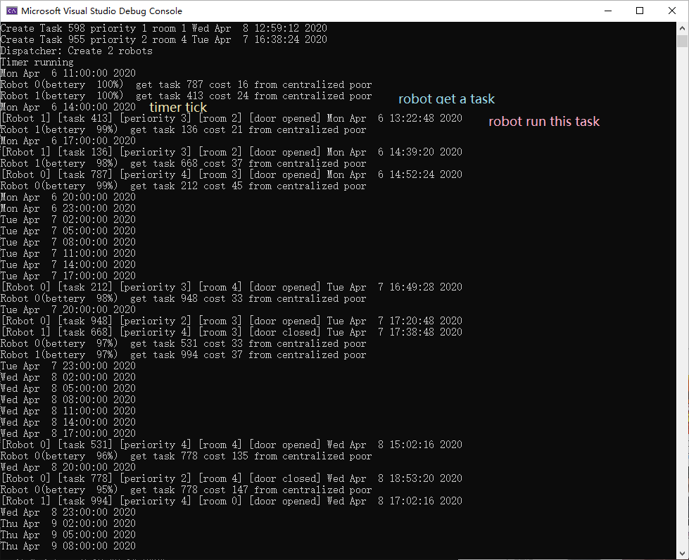

It is a Visual studio CMake program

**Main Thread** It creates task and store them in Global task vector.

**Global task vector** Simulation of centrolized poor

**Robot Thread**  Simulation of robot. It caculates the cost of each task in vector and chooses the one with lower cost

### Structure:

### How to calculate cost:

Cost Function
~~~
cost =  ¦È1 * occupation possibility+  ¦È2 * hour different +  ¦È3* distance + ¦È4* task priority + ¦È5 * task priority + ¦È6

cost =   (100 - occupation possibility) + hour different  + distance + 10 * (highest priority - task priority); 
~~~
Example: 
~~~
last task  task 607 room 0, Tue Apr 7 15:02:08 2020

calculate cost for task 453 room 1 Tue Apr 7 17:38:48 2020

global time 17

cost = (100-100) + (17:38 - 17 ) + 1 = 1
~~~

robot get a occupation possibility from global occupation map.

initial occupation map: 
* Occupation possibility = 100 ( 12 noon to 18 pm)
									= 0 (other time)
* Ocupation map detail

~~~
typedef struct Occu_key { // key
	int room_id;
	int day_of_week;
	int hour;
...
}

typedef struct Occu_params { // value
	int closed_count;
	int opened_count;
	int occupancy_possibility;
...
}
~~~

### TO DO

when robot find door is close, robot should update occupancy map (opened_count and possibility)_)
return task before task running
better simulation and possibility table

### Program result:

### Detail work flow

