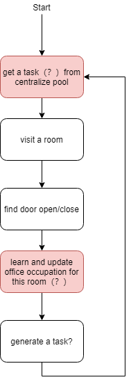
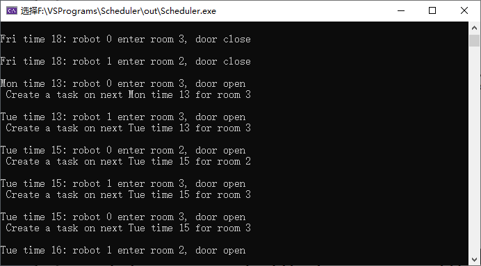
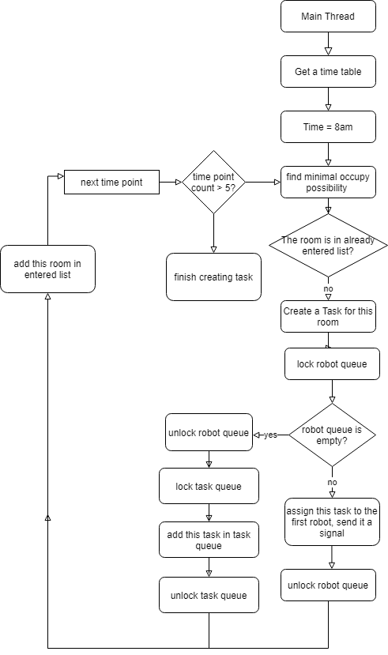

It is a Visual studio CMake program

Robot work flow:

The first week:

The second week:

Disparture(centralized poor) work flow

Questions:

1. who generate initial task?

    *now: centralize pool generate 20 random tasks*
    *when robot find door open, it create a task of same time and day of week*

2. Except "enter room task", what else task do we have?
    
    *now: we only have enter room task for now*
    
3. Task periority in task queue in centralize pool. 

    *now: centralized add 20 tasks and sort the task in queue*
    *robot just pick the first task , and create new task at the end of queue*
    *shortage: add a task for ealier or later time*

4. Time point of tasks are the same.
    
    *if monday 8am door is open, go to the room at next monday 8am* 
    *how about Monday 7am?*
