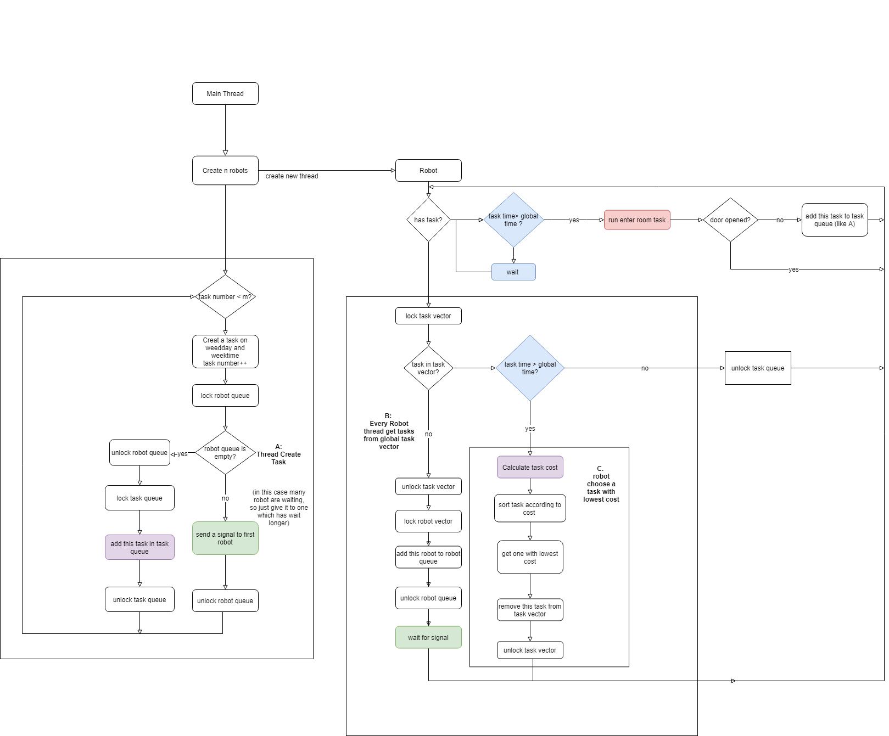

It is a Visual studio CMake program

**Main Thread** It creates task and store them in Global task vector.

**Global task vector** Simulation of centrolized poor

**Robot Thread**  Simulation of robot. It caculates the cost of each task in vector and chooses the one with lower cost

### Structure:

### How to calculate cost:

cost =  distance + hour different;

last task room 1, Fri Apr 10 08:00:00 2020

calculate cost for task room 3, Fri Apr 10 14:00:00 2020

cost = (3-1) + (14-8) = 7

### Improve cost calculation(TO DO)

robot get possibility tables from centrolized poor.

cost =  ¦È1 * occupation +  ¦È2 * hour different +  ¦È3* distance +  ¦È4 * bettery level 

Program result:

### Detail work flow

