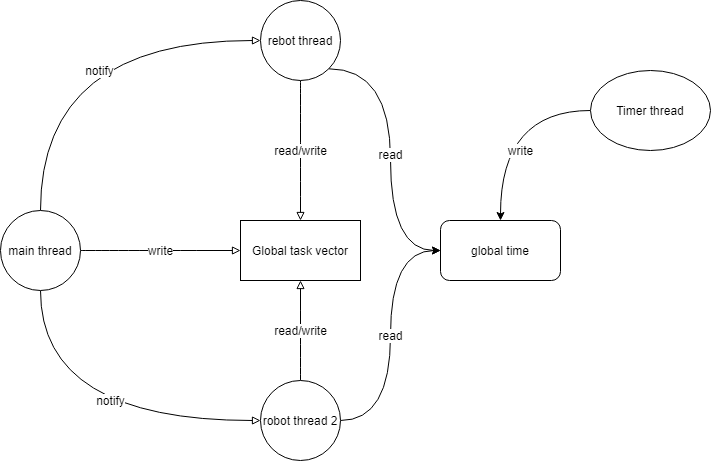
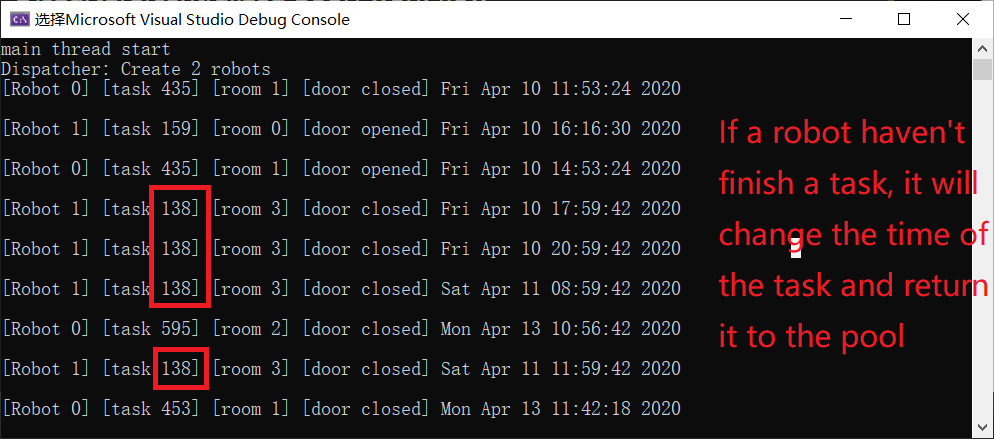

It is a Visual studio CMake program

**Main Thread** Simulation of centrolized poor. It creates task and store them in Global task vector.

**Robot Thread**  Simulation of robot. It caculates the cost of each task in vector and chooses the one with lower cost

Structure:

Detail work flow

Program result:

